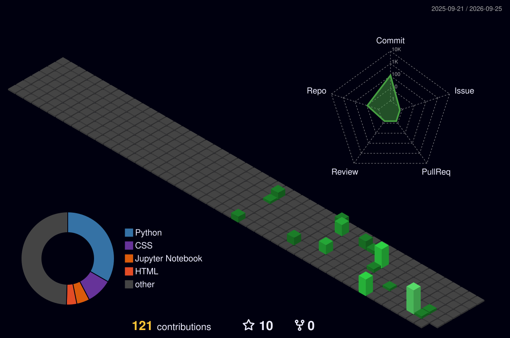

<!-- Custom animated 3D banner: rotating wireframe cube, floating particles, glowing gold title, animated quant chart -->

<!-- Typing animation -->

 

 

## 💰 About Me

- 🧠 Currently building **NeuroVox‑9** — a voice emotion recognition system (ML + Flask)
- 📊 Passionate about **Quantitative problem-solving** — where math meets engineering
- ⚙️ Focused on **Solutions Engineering** — bridging AI research and real-world deployable products
- 🌱 Always sharpening skills in Data Engineering, Applied ML & System Design
- 🎯 Goal: Build things that are technically elegant **and** commercially impactful

 

## 🛠️ Tech Arsenal

 

## 📈 GitHub Stats (Quant Style)

 

 

## 🏙️ 3D Contribution Calendar

  

 

## 🐍 Live Contribution Graph (Animated Snake)

  <picture>
    <source media="(prefers-color-scheme: dark)" srcset="https://raw.githubusercontent.com/muskanmehra09/muskanmehra09/output/github-contribution-grid-snake-dark.svg" />
    <source media="(prefers-color-scheme: light)" srcset="https://raw.githubusercontent.com/muskanmehra09/muskanmehra09/output/github-contribution-grid-snake.svg" />
    
  </picture>

 

## 🚀 Featured Project — NeuroVox‑9

> Turning **voice** and **emotion** into structured, actionable intelligence.

| Layer | Stack |
|---|---|
| Audio Processing | Librosa, PyDub |
| Model | PyTorch / TensorFlow |
| Serving | Flask API |
| Deployment | Docker |

 

**"Not just code — solutions that pay off."** 💛

