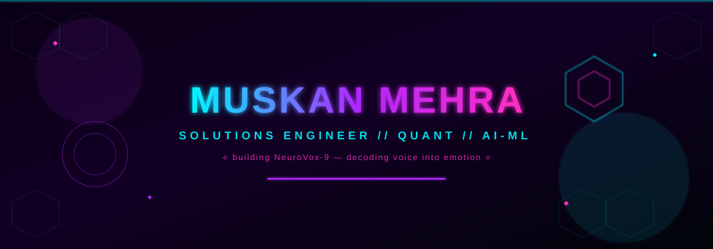
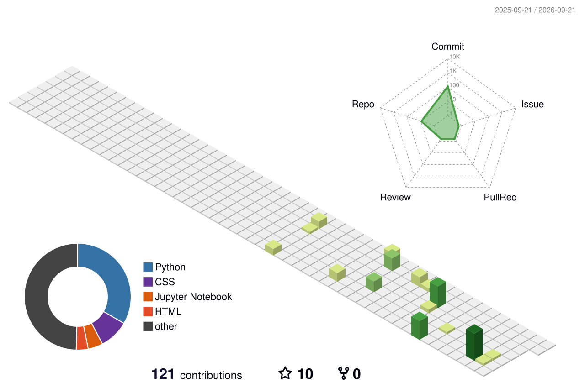

<!-- New identity: cyberpunk neon banner — hexagon grid, radar sweep, holographic scan line -->

<!-- Typing animation — new font + neon cyan/magenta -->

 

 

## ⟡ About Me

- 🧠 Currently building **NeuroVox‑9** — a voice emotion recognition system (ML + Flask)
- 📊 Passionate about **Quantitative problem-solving** — where math meets engineering
- ⚙️ Focused on **Solutions Engineering** — bridging AI research and real-world deployable products
- 🌱 Always sharpening skills in Data Engineering, Applied ML & System Design
- 🎯 Goal: Build things that are technically elegant **and** commercially impactful

 

## ⟡ Tech Arsenal

 

## ⟡ GitHub Stats

 

## ⟡ 3D Contribution Calendar

  

 

## ⟡ Live Contribution Graph (Animated Snake)

  <picture>
    <source media="(prefers-color-scheme: dark)" srcset="https://raw.githubusercontent.com/muskanmehra09/muskanmehra09/output/github-contribution-grid-snake-dark.svg" />
    <source media="(prefers-color-scheme: light)" srcset="https://raw.githubusercontent.com/muskanmehra09/muskanmehra09/output/github-contribution-grid-snake.svg" />
    
  </picture>

 

## ⟡ Featured Project — NeuroVox‑9

> Turning **voice** and **emotion** into structured, actionable intelligence.

| Layer | Stack |
|---|---|
| Audio Processing | Librosa, PyDub |
| Model | PyTorch / TensorFlow |
| Serving | Flask API |
| Deployment | Docker |

 

**"Not just code — solutions that pay off."** ⚡

